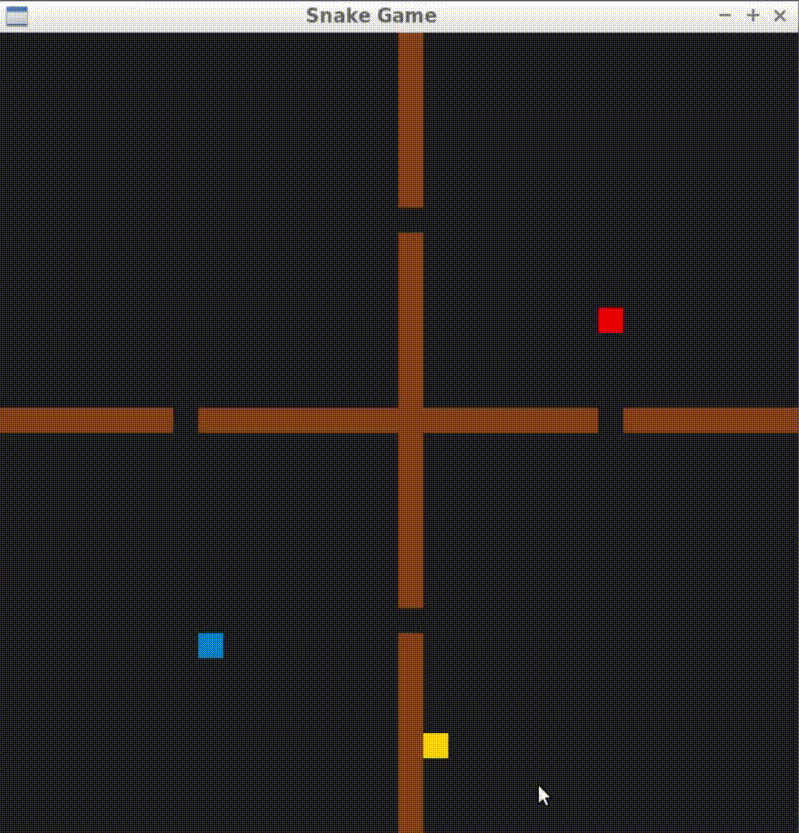

# CPPND: Capstone Snake Game Example

This is a starter repo for the Capstone project in the [Udacity C++ Nanodegree Program](https://www.udacity.com/course/c-plus-plus-nanodegree--nd213). The code for this repo was inspired by [this](https://codereview.stackexchange.com/questions/212296/snake-game-in-c-with-sdl) excellent StackOverflow post and set of responses.

The Capstone Project gives you a chance to integrate what you've learned throughout this program. This project will become an important part of your portfolio to share with current and future colleagues and employers.

In this project, you can build your own C++ application or extend this Snake game, following the principles you have learned throughout this Nanodegree Program. This project will demonstrate that you can independently create applications using a wide range of C++ features.

## Dependencies for Running Locally
* cmake >= 3.7
  * All OSes: [click here for installation instructions](https://cmake.org/install/)
* make >= 4.1 (Linux, Mac), 3.81 (Windows)
  * Linux: make is installed by default on most Linux distros
  * Mac: [install Xcode command line tools to get make](https://developer.apple.com/xcode/features/)
  * Windows: [Click here for installation instructions](http://gnuwin32.sourceforge.net/packages/make.htm)
* SDL2 >= 2.0
  * All installation instructions can be found [here](https://wiki.libsdl.org/Installation)
  >Note that for Linux, an `apt` or `apt-get` installation is preferred to building from source. 
* gcc/g++ >= 5.4
  * Linux: gcc / g++ is installed by default on most Linux distros
  * Mac: same deal as make - [install Xcode command line tools](https://developer.apple.com/xcode/features/)
  * Windows: recommend using [MinGW](http://www.mingw.org/)

## Basic Build Instructions

1. Clone this repo.
2. Make a build directory in the top level directory: `mkdir build && cd build`
3. Compile: `cmake .. && make`
4. Run it: `./SnakeGame`.

## CC Attribution-ShareAlike 4.0 International

Shield: [![CC BY-SA 4.0][cc-by-sa-shield]][cc-by-sa]

This work is licensed under a
[Creative Commons Attribution-ShareAlike 4.0 International License][cc-by-sa].

[![CC BY-SA 4.0][cc-by-sa-image]][cc-by-sa]

[cc-by-sa]: http://creativecommons.org/licenses/by-sa/4.0/
[cc-by-sa-image]: https://licensebuttons.net/l/by-sa/4.0/88x31.png
[cc-by-sa-shield]: https://img.shields.io/badge/License-CC%20BY--SA%204.0-lightgrey.svg

-------------------------------------------------------------------------------------------------------------------------------------------
## MYREADME:

I have added some new features to the basic Snake Game:
1. Obstacles - Snakes cannot cross obstacles. Walls give map more attractive appearance.
2. Enemy Snake - An Enemy Snake is fighting with us for food! He is indeed hard enemy to beat since he is using ASearch method to navigate food and find the fastest path to catch it. BUT his main disadvantage is that he won't cross the map boarders, so we can try to outplay him.
3. Your own level - You can create your own cool map since application reads map from just a text file!  

Now I will describe classes added by me and also I will tell what I have added/changed in the already existing files:

Added classes:
1. Level
  - reads file
  - add path cells and obstacles cells to vectors in order to use them in Renderer class or in an Enemy Class
  - checks wheter an obstacles collides with our snake
  - Search method - calculate Path, by using ASearch alghorithm - creates Path
  - Search2 method - creates Path2 - It is the most interesting part of this class, becouse it corrects the Path created by ASearch alghorithm. ASearch algorithm sometimes fails and finds very long Path. In other words Search2 method finds Path2 from Path, which is way shorter
2. Enemy
  - can has his own speed attribute
  - finds the path to the food by checking, where is the nearest path cell
3. Collision
  - check wheter two blocks collide with each other

Upgraded classes:
1. Game
  - has an Enemy attribute, an Enemy Score
  - before game place food, It will at first check wheter there is not an obstacle 
2. Controller
  - place food, when you hit ENTER (I have added this to debugging purposes, but it is fun, so I have kept that)
  - our Snake move only, when we want, so when we don't click anything our Snake stay idle
3. Renderer
  - now has block as an attribute so It doesn't have to create new "STD_Rect block" in every Renderer::Render call
  - render obstacles, enemy and checking for collision
  - set an Enemy direction
4. Snake
  - has Idle State by default and doesn't get faster in every food 

Added namespace:
  - I have also added header "params.h" - to make life easier every file can now have easy access to basic parameters such as screen or cell size.

## Fulfilled Criteria:
1. The project demonstrates an understanding of C++ functions and control structures.
  - level.cpp, lines: 230-369
2. The project reads data from a file and process the data, or the program writes data to a file.
  - level.cpp, lines: 68-88
3. The project accepts user input and processes the input.
  - controller.cpp, lines: 28-30
  - renderer.cpp, lines: 102-124
4. The project uses Object Oriented Programming techniques.
  - level.h, lines: all
  - enemy.h, lines: all 
5. Classes use appropriate access specifiers for class members.
  - level.h, lines: 12-44; 46-53
6. Class constructors utilize member initialization lists.
  - level.cpp, lines: 11
  - game.cpp, lines: 4-10
7. The project makes use of references in function declarations.
  - level.h, lines: 32,33,38,39